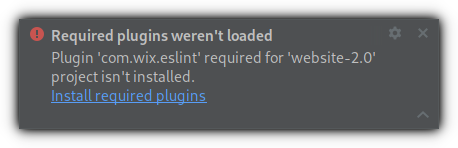
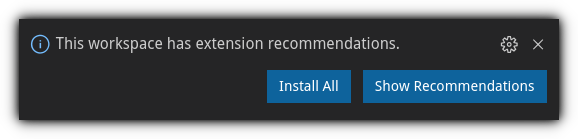

# Impact website 2.0

[](https://travis-ci.com/ImpactDevelopment/Website)
[](https://www.codacy.com/manual/LeafHacker/Website)
[](https://github.com/prettier/prettier)

## How to use

First install npm, then run

```sh
npm install
npm start
```

This will first install all dependancies, then run a development server complete with auto-reload.

## IDE setup

### Atom

- [linter](https://atom.io/packages/linter)
- [linter-eslint](https://atom.io/packages/linter-eslint)
- [editorconfig](https://atom.io/packages/editorconfig)

You can install these by running `apm i linter linter-eslint editorconfig`

### Intellij IDEA and WebStorm

-   [ESLint](https://plugins.jetbrains.com/plugin/7494-eslint)
-   [EditorConfig](https://plugins.jetbrains.com/plugin/7294-editorconfig)

You can use Intellij's Required Plugins feature:
[](https://www.jetbrains.com/help/idea/managing-plugins.html#required-plugins)

You can use the included Run Configurations to run in debugging mode, build the static site or run tests.

### VSCode

You'll want to install the following plugins in your workspace:

-   [ESLint](https://marketplace.visualstudio.com/items?itemName=dbaeumer.vscode-eslint)
-   [EditorConfig](https://marketplace.visualstudio.com/items?itemName=editorconfig.editorconfig)

```sh
# Bash one-liner
for ext in "dbaeumer.vscode-eslint" "editorconfig.editorconfig"; do code --install-extension $ext; done
```

Or use VSCode's built in Recommended Extensions feature:
[](https://code.visualstudio.com/docs/editor/extension-gallery#_workspace-recommended-extensions)

You can use the included debug profile to run the development server in debugging mode.
